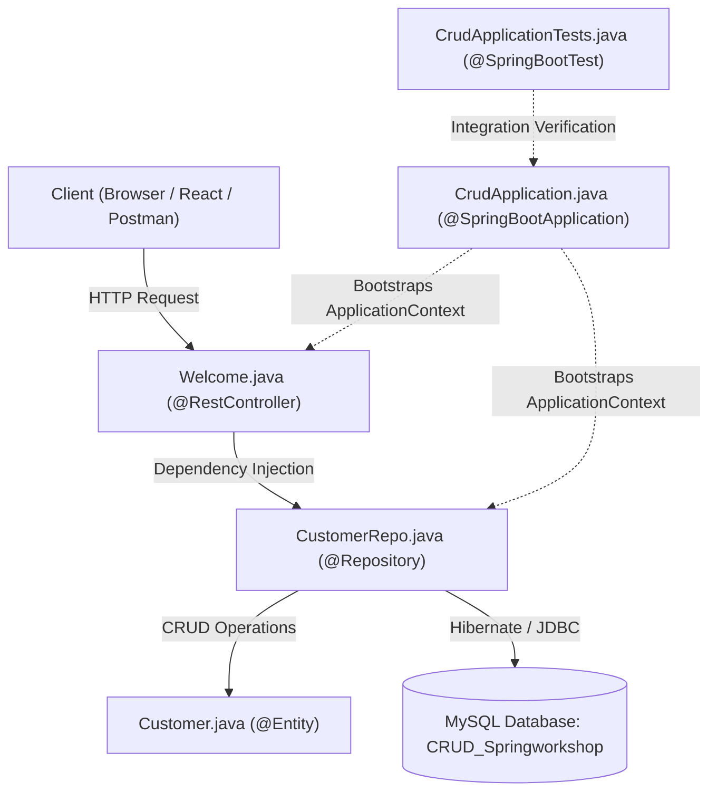

# Spring Boot CRUD Application: Comprehensive Line-by-Line & Code Reference

This document provides a block-by-block, line-by-line breakdown of all five core source files in the `CRUD` project. It covers all keywords, annotations, architectural roles, and underlying mechanisms, followed by the complete, full source code of each file.

---

## Table of Contents
1. [Overview of the 5 Core Files](#overview-of-the-5-core-files)
2. [Detailed Line-by-Line Breakdown by Block](#detailed-line-by-line-breakdown-by-block)
   - [1. CrudApplication.java](#1-crudapplicationjava)
   - [2. Customer.java](#2-customerjava)
   - [3. CustomerRepo.java](#3-customerrepojava)
   - [4. Welcome.java](#4-welcomejava)
   - [5. CrudApplicationTests.java](#5-crudapplicationtestsjava)
3. [Full Source Code of All 5 Files](#full-source-code-of-all-5-files)
   - [Full Code: CrudApplication.java](#full-code-crudapplicationjava)
   - [Full Code: Customer.java](#full-code-customerjava)
   - [Full Code: CustomerRepo.java](#full-code-customerrepojava)
   - [Full Code: Welcome.java](#full-code-welcomejava)
   - [Full Code: CrudApplicationTests.java](#full-code-crudapplicationtestsjava)

---

## Overview of the 5 Core Files



---

## Detailed Line-by-Line Breakdown by Block

---

### 1. `CrudApplication.java`
*Role: Application bootstrap and entry-point.*

#### Block 1: Package & Imports
```java
package com.ruthvik.CRUD;

import org.springframework.boot.SpringApplication;
import org.springframework.boot.autoconfigure.SpringBootApplication;
```
- **`package com.ruthvik.CRUD;`**
  - **Terminology**: `package` keyword.
  - **Purpose**: Defines the root namespace. In Spring Boot, this acts as the **base package**. All Spring beans, controllers, services, and repositories located in this package or any of its subpackages (`com.ruthvik.CRUD.controller`, `com.ruthvik.CRUD.model`, `com.ruthvik.CRUD.repository`) are automatically scanned and registered.
- **`import org.springframework.boot.SpringApplication;`**
  - **Terminology**: Class import.
  - **Purpose**: Brings the `SpringApplication` bootstrap class into scope. This class provides static helper methods to launch the Spring container from a conventional Java `main` method.
- **`import org.springframework.boot.autoconfigure.SpringBootApplication;`**
  - **Terminology**: Annotation import.
  - **Purpose**: Imports the central `@SpringBootApplication` annotation which drives configuration and auto-wiring.

#### Block 2: Class Header & Annotations
```java
@SpringBootApplication
public class CrudApplication {
```
- **`@SpringBootApplication`**
  - **Terminology**: Meta-annotation.
  - **Purpose**: Consolidates three fundamental Spring annotations:
    1. `@Configuration`: Marks the class as a configuration source for Spring beans.
    2. `@EnableAutoConfiguration`: Evaluates dependencies on the classpath (e.g., Spring Web, Spring Data JPA, MySQL Connector, Tomcat) and automatically configures default beans and datasource connections.
    3. `@ComponentScan`: Activates component scanning starting from `com.ruthvik.CRUD`.
- **`public class CrudApplication {`**
  - **Terminology**: `public` access modifier, `class` definition.
  - **Purpose**: Declares the primary configuration class that anchors the Spring application lifecycle.

#### Block 3: Main Bootstrap Method
```java
	public static void main(String[] args) {
		SpringApplication.run(CrudApplication.class, args);
	}
}
```
- **`public static void main(String[] args) {`**
  - **Terminology**: 
    - `public`: Accessible to the JVM from outside the package.
    - `static`: Executable directly without instantiating the class.
    - `void`: Does not return any value.
    - `String[] args`: Captures command-line arguments.
  - **Purpose**: Standard Java entry point.
- **`SpringApplication.run(CrudApplication.class, args);`**
  - **Terminology**: Static factory method invocation.
  - **Purpose**:
    1. Creates and prepares the `ApplicationContext` (IoC container).
    2. Scans for annotated components and binds beans.
    3. Starts the embedded servlet container (Tomcat on port `9991`).
    4. Parses and applies configuration properties from `application.properties`.
- **`}`**: Closes the `main` method.
- **`}`**: Closes the `CrudApplication` class body.

---

### 2. `Customer.java`
*Role: JPA Entity mapping Java objects to relational database tables.*

#### Block 1: Package & Imports
```java
package com.ruthvik.CRUD.model;

import jakarta.persistence.Entity;
import jakarta.persistence.GeneratedValue;
import jakarta.persistence.GenerationType;
import jakarta.persistence.Id;
import jakarta.persistence.Table;

import lombok.Getter;
import lombok.Setter;
```
- **`package com.ruthvik.CRUD.model;`**: Groups the class in the model layer representing the business entity.
- **`import jakarta.persistence.Entity;`**: Jakarta Persistence API (JPA) annotation for designating database-backed objects.
- **`import jakarta.persistence.GeneratedValue;`**: Configures automatic primary key generation.
- **`import jakarta.persistence.GenerationType;`**: Enum providing primary key strategies (`IDENTITY`, `SEQUENCE`, `AUTO`, `TABLE`).
- **`import jakarta.persistence.Id;`**: Declares a field as the primary key.
- **`import jakarta.persistence.Table;`**: Configures the relational table name and options.
- **`import lombok.Getter;`**: Project Lombok annotation to generate getter methods at compile time.
- **`import lombok.Setter;`**: Project Lombok annotation to generate setter methods at compile time.

#### Block 2: Entity & Table Mapping with Lombok
```java
@Entity
@Table(name = "CRUD_Springworkshop")
@Getter
@Setter
public class Customer {
```
- **`@Entity`**
  - **Terminology**: JPA ORM annotation.
  - **Purpose**: Tells Hibernate to manage this class as a database entity, mapping instances of `Customer` to database rows.
- **`@Table(name = "CRUD_Springworkshop")`**
  - **Terminology**: Table mapping annotation.
  - **Purpose**: Explicitly maps this entity to a MySQL table named `CRUD_Springworkshop`. Without this, Hibernate would default to the lowercase class name `customer`.
- **`@Getter`**
  - **Terminology**: Lombok compile-time processor annotation.
  - **Purpose**: Generates standard public getter methods (`getCid()`, `getCname()`, `getProductName()`, `getPrice()`, `getQuantity()`) during compilation to avoid boilerplate code.
- **`@Setter`**
  - **Terminology**: Lombok compile-time processor annotation.
  - **Purpose**: Generates standard public setter methods (`setCid(...)`, `setCname(...)`, etc.) during compilation.
- **`public class Customer {`**
  - **Purpose**: Declares the public entity class representing a customer.

#### Block 3: Primary Key Specification
```java
    @Id
    @GeneratedValue(strategy = GenerationType.IDENTITY)
    Integer cid;
```
- **`@Id`**
  - **Terminology**: Primary Key marker.
  - **Purpose**: Identifies `cid` as the entity's primary key (unique record identifier).
- **`@GeneratedValue(strategy = GenerationType.IDENTITY)`**
  - **Terminology**: Generation strategy attribute.
  - **Purpose**: Delegates primary key generation to the underlying database using MySQL's native `AUTO_INCREMENT` feature.
- **`Integer cid;`**
  - **Terminology**: Wrapper type field.
  - **Purpose**: Holds the customer identifier. The wrapper `Integer` is used instead of primitive `int` so that before a record is saved to the database, its ID can be `null`. A primitive `int` would default to `0`, which can cause Hibernate to incorrectly assume the entity is already persisted.

#### Block 4: Entity Properties / Columns
```java
    String cname;
    String productName;
    Double price;
    Integer quantity;
}
```
- **`String cname;`**: Customer name, mapped to column `cname` (`VARCHAR(255)`).
- **`String productName;`**: Purchased product name, mapped to column `product_name` / `productname`.
- **`Double price;`**: Price of the item, mapped to a `DOUBLE` column; allows fractional decimal amounts and `null` values.
- **`Integer quantity;`**: Quantity of items purchased, mapped to an integer column.
- **`}`**: Closes the `Customer` class body.

---

### 3. `CustomerRepo.java`
*Role: Data Access Layer interface leveraging Spring Data JPA.*

#### Block 1: Package & Imports
```java
package com.ruthvik.CRUD.repository;

import org.springframework.data.jpa.repository.JpaRepository;
import org.springframework.stereotype.Repository;

import com.ruthvik.CRUD.model.Customer;
```
- **`package com.ruthvik.CRUD.repository;`**: Designates this interface as part of the repository/data access layer.
- **`import org.springframework.data.jpa.repository.JpaRepository;`**: Imports Spring Data's primary abstraction for CRUD operations, pagination, and sorting.
- **`import org.springframework.stereotype.Repository;`**: Imports the stereotype annotation for data access components.
- **`import com.ruthvik.CRUD.model.Customer;`**: Imports the entity managed by this repository.

#### Block 2: Interface Declaration & Generic Inheritance
```java
@Repository
public interface CustomerRepo extends JpaRepository<Customer, Integer> {

}
```
- **`@Repository`**
  - **Terminology**: Spring stereotype annotation.
  - **Purpose**: Marks the interface as a Spring-managed Data Access Object (DAO). Enables component scanning and translates native database/JDBC exceptions into Spring's unchecked `DataAccessException`.
- **`public interface CustomerRepo extends JpaRepository<Customer, Integer> {`**
  - **Terminology**:
    - `public interface`: Declares a Java interface contract. No manual implementation class (`CustomerRepoImpl`) is required.
    - `extends JpaRepository<Customer, Integer>`: Inherits full CRUD functionality:
      - `Customer`: The entity type being managed.
      - `Integer`: The data type of the entity's primary key (`@Id Integer cid`).
  - **Internal Mechanism**: At application startup, Spring Data JPA generates a dynamic proxy implementation in memory that provides ready-to-use methods: `save()`, `saveAll()`, `findById()`, `findAll()`, `deleteById()`, `count()`, and `existsById()`.
- **`}`**: Closes the `CustomerRepo` interface body.

---

### 4. `Welcome.java`
*Role: REST Controller handling HTTP requests and routing responses.*

#### Block 1: Package & Imports
```java
package com.ruthvik.CRUD.controller;

import java.util.List;

import org.springframework.beans.factory.annotation.Autowired;
import org.springframework.web.bind.annotation.CrossOrigin;
import org.springframework.web.bind.annotation.DeleteMapping;
import org.springframework.web.bind.annotation.GetMapping;
import org.springframework.web.bind.annotation.PathVariable;
import org.springframework.web.bind.annotation.PostMapping;
import org.springframework.web.bind.annotation.PutMapping;
import org.springframework.web.bind.annotation.RequestBody;
import org.springframework.web.bind.annotation.RestController;

import com.ruthvik.CRUD.model.Customer;
import com.ruthvik.CRUD.repository.CustomerRepo;
```
- **`package com.ruthvik.CRUD.controller;`**: Locates this class in the web controller layer.
- **`import java.util.List;`**: Standard Java collection interface for returning multiple items.
- **`import org.springframework.beans.factory.annotation.Autowired;`**: Spring dependency injection annotation.
- **`import org.springframework.web.bind.annotation.CrossOrigin;`**: Annotation configuring Cross-Origin Resource Sharing (CORS).
- **`import org.springframework.web.bind.annotation.DeleteMapping;`**: Maps HTTP DELETE requests.
- **`import org.springframework.web.bind.annotation.GetMapping;`**: Maps HTTP GET requests.
- **`import org.springframework.web.bind.annotation.PathVariable;`**: Extracts variables from URI path templates.
- **`import org.springframework.web.bind.annotation.PostMapping;`**: Maps HTTP POST requests.
- **`import org.springframework.web.bind.annotation.PutMapping;`**: Maps HTTP PUT requests.
- **`import org.springframework.web.bind.annotation.RequestBody;`**: Deserializes JSON payloads into Java objects.
- **`import org.springframework.web.bind.annotation.RestController;`**: Convenience annotation combining `@Controller` and `@ResponseBody`.
- **`import com.ruthvik.CRUD.model.Customer;`**: Model entity import.
- **`import com.ruthvik.CRUD.repository.CustomerRepo;`**: Repository interface import.

#### Block 2: Controller Header & Injected Dependency
```java
@RestController
@CrossOrigin(origins = "http://localhost:5173")
public class Welcome {

	@Autowired
	CustomerRepo customerRepo;
```
- **`@RestController`**
  - **Terminology**: Specialized Spring Controller annotation.
  - **Purpose**: Marks the class as a RESTful request handler. It implicitly applies `@ResponseBody` to all handler methods, ensuring that Java objects are serialized directly into JSON format (via Jackson) and written into the HTTP response stream.
- **`@CrossOrigin(origins = "http://localhost:5173")`**
  - **Terminology**: CORS policy annotation.
  - **Purpose**: Grants cross-origin request permissions to requests originating from `http://localhost:5173` (e.g. Vite / React dev server). Prevents browser `Access-Control-Allow-Origin` errors.
- **`public class Welcome {`**
  - **Purpose**: Declares the REST controller class.
- **`@Autowired`**
  - **Terminology**: Dependency injection annotation.
  - **Purpose**: Instructs Spring's IoC container to find the proxy bean created for `CustomerRepo` and inject it into this field.
- **`CustomerRepo customerRepo;`**
  - **Purpose**: Holds the injected repository bean used across endpoint methods for database interactions.

#### Block 3: Commented-Out Welcome Test Endpoint
```java
	// http://localhost:9991/hello
	// @GetMapping("/hello")
	// String hello() {
	// return "hello Welcome to SPRING WORKSHOP";
	// }
```
- **Purpose**: Early sanity-check endpoint used during initial setup to test if the embedded Tomcat server was running properly. Commented out once CRUD capabilities were added.

#### Block 4: Read All Customers Endpoint (`GET /getCustList`)
```java
	// http://localhost:9991/getCustList - GET ALL CUSTOMERS
	@GetMapping("/getCustList")
	List<Customer> getAllCustomerDetails() {
		return customerRepo.findAll();
	}
```
- **`// http://localhost:9991/getCustList - GET ALL CUSTOMERS`**: Descriptive developer comment.
- **`@GetMapping("/getCustList")`**
  - **Terminology**: HTTP GET method route mapping.
  - **Purpose**: Maps incoming `GET` requests sent to `/getCustList` to this method.
- **`List<Customer> getAllCustomerDetails() {`**
  - **Terminology**: Method returning a `List` collection.
  - **Purpose**: Spring converts the returned `List<Customer>` into a JSON array (`[{...}, {...}]`) in the HTTP response.
- **`return customerRepo.findAll();`**
  - **Terminology**: Repository query invocation.
  - **Purpose**: Calls `customerRepo.findAll()` which executes `SELECT * FROM CRUD_Springworkshop` in MySQL and returns all customer records.
- **`}`**: Closes the `getAllCustomerDetails` method.

#### Block 5: Read Single Customer by ID Endpoint (`GET /getCust/{cid}`)
```java
	// http://localhost:9991/getCust/1 - GET CUSTOMER BY ID
	@GetMapping("/getCust/{cid}")
	Customer getCustomer(@PathVariable Integer cid) {
		return customerRepo.findById(cid).orElseThrow();
	}
```
- **`// http://localhost:9991/getCust/1 - GET CUSTOMER BY ID`**: Comment illustrating the URI format.
- **`@GetMapping("/getCust/{cid}")`**
  - **Terminology**: URI path variable template.
  - **Purpose**: The `{cid}` portion acts as a dynamic placeholder for the customer ID.
- **`Customer getCustomer(@PathVariable Integer cid) {`**
  - **Terminology**: `@PathVariable` binding.
  - **Purpose**: Binds the value from `{cid}` in the URL directly to the method argument `Integer cid`.
- **`return customerRepo.findById(cid).orElseThrow();`**
  - **Terminology**:
    - `findById(cid)`: Queries database with `SELECT * FROM CRUD_Springworkshop WHERE cid = ?` and returns an `Optional<Customer>`.
    - `.orElseThrow()`: Unwraps the `Optional`. If found, returns the `Customer`. If not found, throws `NoSuchElementException`.
- **`}`**: Closes the `getCustomer` method.

#### Block 6: Create Customer Endpoint (`POST /createCust`) & Bulk Option
```java
	// http://localhost:9991/createCust - CREATE CUSTOMER
    @PostMapping("/createCust")
    public Customer createCustomer(@RequestBody Customer customer) {
        return customerRepo.save(customer);
    }

	// Create multiple customers at once
//	@PostMapping("/createCust")
//	public List<Customer> createCustomers(@RequestBody List<Customer> customers) {
//		return customerRepo.saveAll(customers);
//	}
```
- **`// http://localhost:9991/createCust - CREATE CUSTOMER`**: Comment documentation.
- **`@PostMapping("/createCust")`**
  - **Terminology**: HTTP POST method route mapping.
  - **Purpose**: Directs HTTP `POST` requests to `/createCust` to this method for inserting new records.
- **`public Customer createCustomer(@RequestBody Customer customer) {`**
  - **Terminology**: `@RequestBody` deserialization.
  - **Purpose**: Jackson takes the JSON object payload from the HTTP request body and converts it into a `Customer` Java object.
- **`return customerRepo.save(customer);`**
  - **Terminology**: Persistence invocation.
  - **Purpose**: Because the incoming `customer` has a `null` ID, Hibernate triggers an `INSERT INTO CRUD_Springworkshop ...` query. MySQL assigns the auto-increment ID, and the newly saved entity (with its generated `cid`) is returned as JSON.
- **`}`**: Closes the `createCustomer` method.
- **`// Create multiple customers at once` through `// }`**: Commented-out implementation demonstrating bulk insertion by accepting `List<Customer>` and invoking `saveAll(...)`.

#### Block 7: Update Customer Endpoint (`PUT /updateCust/{cid}`)
```java
	// http://localhost:9991/updateCust/1 - UPDATE CUSTOMER
	@PutMapping("/updateCust/{cid}")
	Customer updateCustomer(@RequestBody Customer customer, @PathVariable Integer cid) {

		Customer custFromDb = customerRepo.findById(cid).orElseThrow();

		custFromDb.setCname(customer.getCname());
		custFromDb.setProductName(customer.getProductName());
		custFromDb.setPrice(customer.getPrice());
		custFromDb.setQuantity(customer.getQuantity());

		return customerRepo.save(custFromDb);
	}
```
- **`// http://localhost:9991/updateCust/1 - UPDATE CUSTOMER`**: Comment documentation.
- **`@PutMapping("/updateCust/{cid}")`**
  - **Terminology**: HTTP PUT method route mapping.
  - **Purpose**: PUT is the standard HTTP method for updating existing resources.
- **`Customer updateCustomer(@RequestBody Customer customer, @PathVariable Integer cid) {`**
  - **Terminology**: Combined `@RequestBody` (new values) and `@PathVariable` (target record ID).
  - **Purpose**: Captures both the replacement data and the ID of the row to be modified.
- **`Customer custFromDb = customerRepo.findById(cid).orElseThrow();`**
  - **Purpose**: Fetches the existing row from MySQL. If the ID does not exist, an exception is thrown, preventing invalid updates.
- **`custFromDb.setCname(customer.getCname());`**: Updates the customer name field.
- **`custFromDb.setProductName(customer.getProductName());`**: Updates the product name field.
- **`custFromDb.setPrice(customer.getPrice());`**: Updates the price field.
- **`custFromDb.setQuantity(customer.getQuantity());`**: Updates the quantity field.
- **`return customerRepo.save(custFromDb);`**
  - **Terminology**: Update persistence.
  - **Purpose**: Because `custFromDb` already has an existing primary key `cid`, Hibernate performs an `UPDATE CRUD_Springworkshop SET ... WHERE cid = ?` statement and returns the updated customer.
- **`}`**: Closes the `updateCustomer` method.

#### Block 8: Delete Customer Endpoint (`DELETE /delCust/{cid}`)
```java
	// http://localhost:9991/delCust/1 - DELETE CUSTOMER
	@DeleteMapping("/delCust/{cid}")
	String deleteCustomer(@PathVariable Integer cid) {

		customerRepo.deleteById(cid);

		return "Customer has been deleted successfully with id of " + cid;
	}
}
```
- **`// http://localhost:9991/delCust/1 - DELETE CUSTOMER`**: Comment documentation.
- **`@DeleteMapping("/delCust/{cid}")`**
  - **Terminology**: HTTP DELETE route mapping.
  - **Purpose**: Maps incoming HTTP `DELETE` requests for `/delCust/{cid}` to this method.
- **`String deleteCustomer(@PathVariable Integer cid) {`**
  - **Purpose**: Receives the target record ID and returns a status confirmation message.
- **`customerRepo.deleteById(cid);`**
  - **Terminology**: Repository delete operation.
  - **Purpose**: Issues a `DELETE FROM CRUD_Springworkshop WHERE cid = ?` SQL statement to remove the record.
- **`return "Customer has been deleted successfully with id of " + cid;`**
  - **Purpose**: Returns a plain text confirmation string to the client.
- **`}`**: Closes the `deleteCustomer` method.
- **`}`**: Closes the `Welcome` class body.

---

### 5. `CrudApplicationTests.java`
*Role: Integration test suite verifying Spring application context bootstrapping.*

#### Block 1: Package & Imports
```java
package com.ruthvik.CRUD;

import org.junit.jupiter.api.Test;
import org.springframework.boot.test.context.SpringBootTest;
```
- **`package com.ruthvik.CRUD;`**: Places tests in the matching test package structure under `src/test/java`.
- **`import org.junit.jupiter.api.Test;`**: Imports JUnit 5's `@Test` annotation.
- **`import org.springframework.boot.test.context.SpringBootTest;`**: Imports Spring Boot's context-loading test annotation.

#### Block 2: Test Class & Context Load Test
```java
@SpringBootTest
class CrudApplicationTests {

	@Test
	void contextLoads() {
	}

}
```
- **`@SpringBootTest`**
  - **Terminology**: Spring Boot test framework annotation.
  - **Purpose**: Bootstraps the full application context before executing test methods. Verifies that all beans, configurations, database connections, and annotations can initialize without crashing.
- **`class CrudApplicationTests {`**
  - **Terminology**: JUnit 5 test class.
  - **Purpose**: Container for test methods. JUnit 5 does not require `public` visibility.
- **`@Test`**
  - **Terminology**: Test method annotation.
  - **Purpose**: Designates `contextLoads()` as an executable test method recognized by the test runner.
- **`void contextLoads() {`**
  - **Terminology**: Smoke test method.
  - **Purpose**: Serves as a smoke test. Even though the body is empty, the test will fail if any configuration error, broken bean dependency, or database misconfiguration prevents the Spring container from starting.
- **`}`**: Closes the `contextLoads` method.
- **`}`**: Closes the `CrudApplicationTests` class body.

---

## Full Source Code of All 5 Files

Below is the complete, unmodified code for all 5 files in the project.

---

### Full Code: `CrudApplication.java`
**File Path**: [`CRUD/src/main/java/com/ruthvik/CRUD/CrudApplication.java`](file:///d:/VCUBE/SPRING_PROJECT_WORKSHOP/CRUD/src/main/java/com/ruthvik/CRUD/CrudApplication.java)

```java
package com.ruthvik.CRUD;

import org.springframework.boot.SpringApplication;
import org.springframework.boot.autoconfigure.SpringBootApplication;

@SpringBootApplication
public class CrudApplication {

	public static void main(String[] args) {
		SpringApplication.run(CrudApplication.class, args);
	}

}
```

---

### Full Code: `Customer.java`
**File Path**: [`CRUD/src/main/java/com/ruthvik/CRUD/model/Customer.java`](file:///d:/VCUBE/SPRING_PROJECT_WORKSHOP/CRUD/src/main/java/com/ruthvik/CRUD/model/Customer.java)

```java
package com.ruthvik.CRUD.model;

import jakarta.persistence.Entity;
import jakarta.persistence.GeneratedValue;
import jakarta.persistence.GenerationType;
import jakarta.persistence.Id;
import jakarta.persistence.Table;

import lombok.Getter;
import lombok.Setter;

@Entity
@Table(name = "CRUD_Springworkshop")
@Getter
@Setter
public class Customer {

    @Id
    @GeneratedValue(strategy = GenerationType.IDENTITY)
    Integer cid;
    String cname;
    String productName;
    Double price;
    Integer quantity;
}
```

---

### Full Code: `CustomerRepo.java`
**File Path**: [`CRUD/src/main/java/com/ruthvik/CRUD/repository/CustomerRepo.java`](file:///d:/VCUBE/SPRING_PROJECT_WORKSHOP/CRUD/src/main/java/com/ruthvik/CRUD/repository/CustomerRepo.java)

```java
package com.ruthvik.CRUD.repository;

import org.springframework.data.jpa.repository.JpaRepository;
import org.springframework.stereotype.Repository;

import com.ruthvik.CRUD.model.Customer;

@Repository
public interface CustomerRepo extends JpaRepository<Customer, Integer> {

}
```

---

### Full Code: `Welcome.java`
**File Path**: [`CRUD/src/main/java/com/ruthvik/CRUD/controller/Welcome.java`](file:///d:/VCUBE/SPRING_PROJECT_WORKSHOP/CRUD/src/main/java/com/ruthvik/CRUD/controller/Welcome.java)

```java
package com.ruthvik.CRUD.controller;

import java.util.List;

import org.springframework.beans.factory.annotation.Autowired;
import org.springframework.web.bind.annotation.CrossOrigin;
import org.springframework.web.bind.annotation.DeleteMapping;
import org.springframework.web.bind.annotation.GetMapping;
import org.springframework.web.bind.annotation.PathVariable;
import org.springframework.web.bind.annotation.PostMapping;
import org.springframework.web.bind.annotation.PutMapping;
import org.springframework.web.bind.annotation.RequestBody;
import org.springframework.web.bind.annotation.RestController;

import com.ruthvik.CRUD.model.Customer;
import com.ruthvik.CRUD.repository.CustomerRepo;

@RestController
@CrossOrigin(origins = "http://localhost:5173")
public class Welcome {

	@Autowired
	CustomerRepo customerRepo;

	// http://localhost:9991/hello
	// @GetMapping("/hello")
	// String hello() {
	// return "hello Welcome to SPRING WORKSHOP";
	// }

	// http://localhost:9991/getCustList - GET ALL CUSTOMERS
	@GetMapping("/getCustList")
	List<Customer> getAllCustomerDetails() {
		return customerRepo.findAll();
	}

	// http://localhost:9991/getCust/1 - GET CUSTOMER BY ID
	@GetMapping("/getCust/{cid}")
	Customer getCustomer(@PathVariable Integer cid) {
		return customerRepo.findById(cid).orElseThrow();
	}

	// http://localhost:9991/createCust - CREATE CUSTOMER
    @PostMapping("/createCust")
    public Customer createCustomer(@RequestBody Customer customer) {
        return customerRepo.save(customer);
    }

	// Create multiple customers at once
//	@PostMapping("/createCust")
//	public List<Customer> createCustomers(@RequestBody List<Customer> customers) {
//		return customerRepo.saveAll(customers);
//	}

	// http://localhost:9991/updateCust/1 - UPDATE CUSTOMER
	@PutMapping("/updateCust/{cid}")
	Customer updateCustomer(@RequestBody Customer customer, @PathVariable Integer cid) {

		Customer custFromDb = customerRepo.findById(cid).orElseThrow();

		custFromDb.setCname(customer.getCname());
		custFromDb.setProductName(customer.getProductName());
		custFromDb.setPrice(customer.getPrice());
		custFromDb.setQuantity(customer.getQuantity());

		return customerRepo.save(custFromDb);
	}

	// http://localhost:9991/delCust/1 - DELETE CUSTOMER
	@DeleteMapping("/delCust/{cid}")
	String deleteCustomer(@PathVariable Integer cid) {

		customerRepo.deleteById(cid);

		return "Customer has been deleted successfully with id of " + cid;
	}
}
```

---

### Full Code: `CrudApplicationTests.java`
**File Path**: [`CRUD/src/test/java/com/ruthvik/CRUD/CrudApplicationTests.java`](file:///d:/VCUBE/SPRING_PROJECT_WORKSHOP/CRUD/src/test/java/com/ruthvik/CRUD/CrudApplicationTests.java)

```java
package com.ruthvik.CRUD;

import org.junit.jupiter.api.Test;
import org.springframework.boot.test.context.SpringBootTest;

@SpringBootTest
class CrudApplicationTests {

	@Test
	void contextLoads() {
	}

}
```
